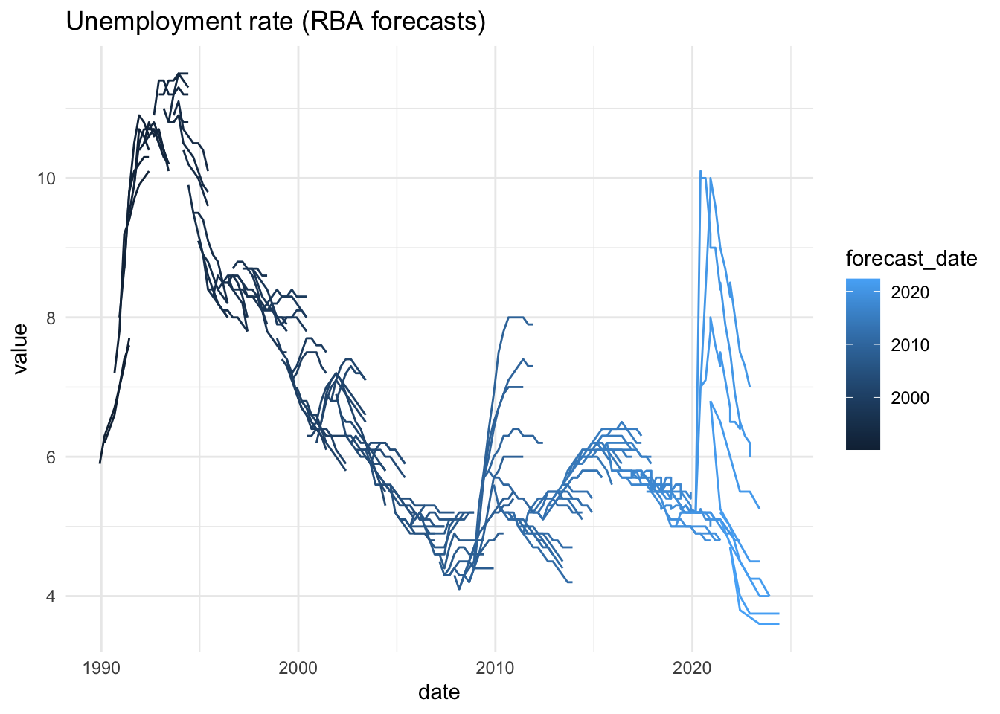

<!-- README.md is generated from README.Rmd. Please edit that file -->

# readrba 

<!-- badges: start -->

[](https://github.com/MattCowgill/readrba/actions)
[](https://lifecycle.r-lib.org/articles/stages.html)
[](https://app.codecov.io/gh/MattCowgill/readrba?branch=master)
[](https://CRAN.R-project.org/package=readrba)
<!-- badges: end -->

Get data from the [Reserve Bank of
Australia](https://rba.gov.au/statistics/tables/) in a
[tidy](https://tidyr.tidyverse.org/articles/tidy-data.html)
[tibble](https://tibble.tidyverse.org).

## Installation

Install from CRAN using:

``` r
install.packages("readrba")
```

Or install the development version from GitHub:

``` r
remotes::install_github("mattcowgill/readrba")
```

## Examples

``` r
library(ggplot2)
library(dplyr)
library(readrba)
```

### Quick examples

With a few lines of code, you can get a data series from the RBA and
visualise it. Here’s the unemployment rate:

``` r
unemp_rate <- read_rba(series_id = "GLFSURSA") 

unemp_rate %>%
  ggplot(aes(x = date, y = value)) +
  geom_line() +
  theme_minimal() +
  labs(title = "Unemployment rate (actual)")
```


And you can also easily get the RBA’s public forecasts - from 1990 to
present - and visualise those. Here’s every public forecast of the
unemployment rate the RBA has made over the past three decades:

``` r
unemp_forecasts <- rba_forecasts() %>%
  filter(series == "unemp_rate")


unemp_forecasts %>%
  ggplot(aes(x = date, 
             y = value, 
             group = forecast_date, 
             col = forecast_date)) +
  geom_line() +
  theme_minimal() +
  labs(title = "Unemployment rate (RBA forecasts)")
```



### Reading RBA data

There primary function in {readrba} is `read_rba()`.

Here’s how you fetch the current version of a single RBA statistical
table: table G1, consumer price inflation using `read_rba()`:

``` r
cpi_table <- read_rba(table_no = "g1")
```

The object returned by `read_rba()` is a tidy tibble (ie. in ‘long’
format):

``` r
head(cpi_table)
#> # A tibble: 6 × 11
#>   date       series        value frequ…¹ serie…² units source pub_date   serie…³
#>   <date>     <chr>         <dbl> <chr>   <chr>   <chr> <chr>  <date>     <chr>  
#> 1 1922-06-01 Consumer pri…   2.8 Quarte… Origin… Inde… ABS /… 2022-07-28 GCPIAG 
#> 2 1922-09-01 Consumer pri…   2.8 Quarte… Origin… Inde… ABS /… 2022-07-28 GCPIAG 
#> 3 1922-12-01 Consumer pri…   2.7 Quarte… Origin… Inde… ABS /… 2022-07-28 GCPIAG 
#> 4 1923-03-01 Consumer pri…   2.7 Quarte… Origin… Inde… ABS /… 2022-07-28 GCPIAG 
#> 5 1923-06-01 Consumer pri…   2.8 Quarte… Origin… Inde… ABS /… 2022-07-28 GCPIAG 
#> 6 1923-09-01 Consumer pri…   2.9 Quarte… Origin… Inde… ABS /… 2022-07-28 GCPIAG 
#> # … with 2 more variables: description <chr>, table_title <chr>, and
#> #   abbreviated variable names ¹​frequency, ²​series_type, ³​series_id
```

You can also request multiple tables. They’ll be returned together as
one tidy tibble:

``` r
rba_data <- read_rba(table_no = c("a1", "g1"))

head(rba_data)
#> # A tibble: 6 × 11
#>   date       series        value frequ…¹ serie…² units source pub_date   serie…³
#>   <date>     <chr>         <dbl> <chr>   <chr>   <chr> <chr>  <date>     <chr>  
#> 1 1994-06-01 Australian d… 13680 Weekly  Origin… $ mi… RBA    2022-09-02 ARBAAA…
#> 2 1994-06-08 Australian d… 13055 Weekly  Origin… $ mi… RBA    2022-09-02 ARBAAA…
#> 3 1994-06-15 Australian d… 13086 Weekly  Origin… $ mi… RBA    2022-09-02 ARBAAA…
#> 4 1994-06-22 Australian d… 12802 Weekly  Origin… $ mi… RBA    2022-09-02 ARBAAA…
#> 5 1994-06-29 Australian d… 13563 Weekly  Origin… $ mi… RBA    2022-09-02 ARBAAA…
#> 6 1994-07-06 Australian d… 12179 Weekly  Origin… $ mi… RBA    2022-09-02 ARBAAA…
#> # … with 2 more variables: description <chr>, table_title <chr>, and
#> #   abbreviated variable names ¹​frequency, ²​series_type, ³​series_id

unique(rba_data$table_title)
#> [1] "A1 Reserve Bank Of Australia - Liabilities And Assets - Summary"
#> [2] "G1 Consumer Price Inflation"
```

You can also retrieve data based on the unique RBA time series
identifier(s). For example, to getch the consumer price index series
only:

``` r
cpi_series <- read_rba(series_id = "GCPIAG")
head(cpi_series)
#> # A tibble: 6 × 11
#>   date       series        value frequ…¹ serie…² units source pub_date   serie…³
#>   <date>     <chr>         <dbl> <chr>   <chr>   <chr> <chr>  <date>     <chr>  
#> 1 1922-06-01 Consumer pri…   2.8 Quarte… Origin… Inde… ABS /… 2022-07-28 GCPIAG 
#> 2 1922-09-01 Consumer pri…   2.8 Quarte… Origin… Inde… ABS /… 2022-07-28 GCPIAG 
#> 3 1922-12-01 Consumer pri…   2.7 Quarte… Origin… Inde… ABS /… 2022-07-28 GCPIAG 
#> 4 1923-03-01 Consumer pri…   2.7 Quarte… Origin… Inde… ABS /… 2022-07-28 GCPIAG 
#> 5 1923-06-01 Consumer pri…   2.8 Quarte… Origin… Inde… ABS /… 2022-07-28 GCPIAG 
#> 6 1923-09-01 Consumer pri…   2.9 Quarte… Origin… Inde… ABS /… 2022-07-28 GCPIAG 
#> # … with 2 more variables: description <chr>, table_title <chr>, and
#> #   abbreviated variable names ¹​frequency, ²​series_type, ³​series_id
unique(cpi_series$series_id)
#> [1] "GCPIAG"
```

The convenience function `read_rba_seriesid()` is a wrapper around
`read_rba()`. This means `read_rba_seriesid("GCPIAG")` is equivalent to
`read_rba(series_id = "GCPIAG")`.

By default, `read_rba()` fetches the current version of whatever table
you request. You can specify the historical version of a table, if it’s
available, using the `cur_hist` argument:

``` r

hist_a11 <- read_rba(table_no = "a1.1", cur_hist = "historical")

head(hist_a11)
#> # A tibble: 6 × 11
#>   date       series        value frequ…¹ serie…² units source pub_date   serie…³
#>   <date>     <chr>         <dbl> <chr>   <chr>   <chr> <chr>  <date>     <chr>  
#> 1 1977-07-31 Australian G…   654 Monthly Origin… $ mi… RBA    2015-06-26 ARBALD…
#> 2 1977-08-31 Australian G…   665 Monthly Origin… $ mi… RBA    2015-06-26 ARBALD…
#> 3 1977-09-30 Australian G…   695 Monthly Origin… $ mi… RBA    2015-06-26 ARBALD…
#> 4 1977-10-31 Australian G…   609 Monthly Origin… $ mi… RBA    2015-06-26 ARBALD…
#> 5 1977-11-30 Australian G…   560 Monthly Origin… $ mi… RBA    2015-06-26 ARBALD…
#> 6 1977-12-31 Australian G…   614 Monthly Origin… $ mi… RBA    2015-06-26 ARBALD…
#> # … with 2 more variables: description <chr>, table_title <chr>, and
#> #   abbreviated variable names ¹​frequency, ²​series_type, ³​series_id
```

### Browsing RBA data

Two functions are provided to help you find the table number or series
ID you need. These are `browse_rba_tables()` and `browse_rba_series()`.
Each returns a tibble with information about the available RBA data.

``` r
browse_rba_tables()
#> # A tibble: 123 × 5
#>    title                                             no    url   curre…¹ reada…²
#>    <chr>                                             <chr> <chr> <chr>   <lgl>  
#>  1 Liabilities and Assets – Summary                  A1    http… current TRUE   
#>  2 Liabilities and Assets – Detailed                 A1.1  http… current TRUE   
#>  3 Monetary Policy Changes                           A2    http… current TRUE   
#>  4 Monetary Policy Operations – Current              A3    http… current TRUE   
#>  5 Holdings of Australian Government Securities and… A3.1  http… current TRUE   
#>  6 Securities Lending Repurchase and Switch Transac… A3.2  http… current TRUE   
#>  7 Foreign Exchange Transactions and Holdings of Of… A4    http… current TRUE   
#>  8 Daily Foreign Exchange Market Intervention Trans… A5    http… current TRUE   
#>  9 Banknotes on Issue by Denomination                A6    http… current TRUE   
#> 10 Detected Australian Counterfeits by Denomination  A7    http… current TRUE   
#> # … with 113 more rows, and abbreviated variable names ¹​current_or_historical,
#> #   ²​readable
```

``` r
browse_rba_series()
#> # A tibble: 4,478 × 8
#>    table_no series               serie…¹ serie…² table…³ cur_h…⁴ descr…⁵ frequ…⁶
#>    <chr>    <chr>                <chr>   <chr>   <chr>   <chr>   <chr>   <chr>  
#>  1 A1       Australian dollar i… ARBAAA… Origin… A1 Res… current Austra… Weekly 
#>  2 A1       Capital and Reserve… ARBALC… Origin… A1 Res… current Capita… Weekly 
#>  3 A1       Deposits (excluding… ARBALD… Origin… A1 Res… current Deposi… Weekly 
#>  4 A1       Exchange settlement… ARBALE… Origin… A1 Res… current Exchan… Weekly 
#>  5 A1       Gold and foreign ex… ARBAAG… Origin… A1 Res… current Gold a… Weekly 
#>  6 A1       Notes on issue       ARBALN… Origin… A1 Res… current Notes … Weekly 
#>  7 A1       Other assets (inclu… ARBAAO… Origin… A1 Res… current Other … Weekly 
#>  8 A1       Other liabilities    ARBALO… Origin… A1 Res… current Other … Weekly 
#>  9 A1       Total assets         ARBAAT… Origin… A1 Res… current Total … Weekly 
#> 10 A1       Total liabilities    ARBALT… Origin… A1 Res… current Total … Weekly 
#> # … with 4,468 more rows, and abbreviated variable names ¹​series_id,
#> #   ²​series_type, ³​table_title, ⁴​cur_hist, ⁵​description, ⁶​frequency
```

You can specify a search string to filter the tables or series, as in:

``` r
browse_rba_tables("inflation")
#> # A tibble: 3 × 5
#>   title                                         no    url        curre…¹ reada…²
#>   <chr>                                         <chr> <chr>      <chr>   <lgl>  
#> 1 Consumer Price Inflation                      G1    https://w… current TRUE   
#> 2 Consumer Price Inflation – Expenditure Groups G2    https://w… current TRUE   
#> 3 Inflation Expectations                        G3    https://w… current TRUE   
#> # … with abbreviated variable names ¹​current_or_historical, ²​readable
```

### RBA forecasts

The function `rba_forecasts()` provides easy access to all the RBA’s
public forecasts of key economic variables since 1990. The function
scrapes the RBA website to obtain the latest Statement on Monetary
Policy forecasts.

``` r
rba_forecasts()
#> # A tibble: 5,485 × 8
#>    series_desc           forecast…¹ notes source value date       year_…² series
#>    <chr>                 <date>     <chr> <chr>  <dbl> <date>       <dbl> <chr> 
#>  1 CPI - 4 quarter chan… 1990-03-01 <NA>  JEFG     8.6 1990-03-01   1990. cpi_a…
#>  2 CPI - 4 quarter chan… 1990-03-01 <NA>  JEFG     7.6 1990-06-01   1990. cpi_a…
#>  3 CPI - 4 quarter chan… 1990-03-01 <NA>  JEFG     6.5 1990-09-01   1990. cpi_a…
#>  4 CPI - 4 quarter chan… 1990-03-01 <NA>  JEFG     6   1990-12-01   1990. cpi_a…
#>  5 CPI - 4 quarter chan… 1990-03-01 <NA>  JEFG     5.9 1991-03-01   1991. cpi_a…
#>  6 CPI - 4 quarter chan… 1990-03-01 <NA>  JEFG     6.2 1991-06-01   1991. cpi_a…
#>  7 Unemployment rate - … 1990-03-01 <NA>  JEFG     5.9 1989-12-01   1989. unemp…
#>  8 Unemployment rate - … 1990-03-01 <NA>  JEFG     6.3 1990-03-01   1990. unemp…
#>  9 Unemployment rate - … 1990-03-01 <NA>  JEFG     6.5 1990-06-01   1990. unemp…
#> 10 Unemployment rate - … 1990-03-01 <NA>  JEFG     6.7 1990-09-01   1990. unemp…
#> # … with 5,475 more rows, and abbreviated variable names ¹​forecast_date,
#> #   ²​year_qtr
```

If you just want the latest forecasts, you can request them:

``` r
rba_forecasts(all_or_latest = "latest")
#> # A tibble: 102 × 8
#>    forecast_date date       series            value serie…¹ source notes year_…²
#>    <date>        <date>     <chr>             <dbl> <chr>   <chr>  <chr>   <dbl>
#>  1 2022-08-01    2022-06-01 aena_change         5.2 Nomina… SMP    (a) …   2022.
#>  2 2022-08-01    2022-12-01 aena_change         3   Nomina… SMP    (a) …   2022.
#>  3 2022-08-01    2023-06-01 aena_change         4.1 Nomina… SMP    (a) …   2023.
#>  4 2022-08-01    2023-12-01 aena_change         5   Nomina… SMP    (a) …   2023.
#>  5 2022-08-01    2024-06-01 aena_change         5   Nomina… SMP    (a) …   2024.
#>  6 2022-08-01    2024-12-01 aena_change         4.9 Nomina… SMP    (a) …   2024.
#>  7 2022-08-01    2022-06-01 business_inv_cha…   1.6 Busine… SMP    (a) …   2022.
#>  8 2022-08-01    2022-12-01 business_inv_cha…   4.9 Busine… SMP    (a) …   2022.
#>  9 2022-08-01    2023-06-01 business_inv_cha…   5.9 Busine… SMP    (a) …   2023.
#> 10 2022-08-01    2023-12-01 business_inv_cha…   6.6 Busine… SMP    (a) …   2023.
#> # … with 92 more rows, and abbreviated variable names ¹​series_desc, ²​year_qtr
```

## Data availability

The `read_rba()` function is able to import most tables on the
[Statistical Tables](https://rba.gov.au/statistics/tables/) page of the
RBA website. These are the tables that are downloaded when you use
`read_rba(cur_hist = "current")`, the default.

`read_rba()` can also download many of the tables on the [Historical
Data](https://rba.gov.au/statistics/historical-data.html) page of the
RBA website. To get these, specify `cur_hist = "historical"` in
`read_rba()`.

### Historical exchange rate tables

The historical exchange rate tables do not have table numbers on the RBA
website. They can still be downloaded, using the following table
numbers:

| Table title                                                                      | table_no         |
|:---------------------------------------------------------------------------------|:-----------------|
| Exchange Rates – Daily – 1983 to 1986                                            | ex_daily_8386    |
| Exchange Rates – Daily – 1987 to 1990                                            | ex_daily_8790    |
| Exchange Rates – Daily – 1991 to 1994                                            | ex_daily_9194    |
| Exchange Rates – Daily – 1995 to 1998                                            | ex_daily_9598    |
| Exchange Rates – Daily – 1999 to 2002                                            | ex_daily_9902    |
| Exchange Rates – Daily – 2003 to 2006                                            | ex_daily_0306    |
| Exchange Rates – Daily – 2007 to 2009                                            | ex_daily_0709    |
| Exchange Rates – Daily – 2010 to 2013                                            | ex_daily_1013    |
| Exchange Rates – Daily – 2014 to 2017                                            | ex_daily_1417    |
| Exchange Rates – Daily – 2018 to Current                                         | ex_daily_18cur   |
| Exchange Rates – Monthly – January 2010 to latest complete month of current year | ex_monthly_10cur |
| Exchange Rates – Monthly – July 1969 to December 2009                            | ex_monthly_6909  |

### Non-standard tables

`read_rba()` is currently only able to import RBA statistical tables
that are formatted in a (more or less) standard way. Some are formatted
in a non-standard way, either because they’re distributions rather than
time series, or because they’re particularly old.

Tables that are **not** able to be downloaded are:

| Table title                                                               | table_no | current_or_historical |
|:--------------------------------------------------------------------------|:---------|:----------------------|
| Household Balance Sheets – Distribution                                   | E3       | current               |
| Household Gearing – Distribution                                          | E4       | current               |
| Household Financial Assets – Distribution                                 | E5       | current               |
| Household Non-Financial Assets – Distribution                             | E6       | current               |
| Household Debt – Distribution                                             | E7       | current               |
| Open Market Operations – 2012 to 2013                                     | A3       | historical            |
| Open Market Operations – 2009 to 2011                                     | A3       | historical            |
| Open Market Operations – 2003 to 2008                                     | A3       | historical            |
| Individual Banks’ Assets – 1991–1992 to 1997–1998                         | J1       | historical            |
| Individual Banks’ Liabilities – 1991–1992 to 1997–1998                    | J2       | historical            |
| Treasury Note Tenders - 1989–2006                                         | E4       | historical            |
| Treasury Bond Tenders – 1982–2006                                         | E5       | historical            |
| Treasury Bond Tenders – Amount Allotted, by Years to Maturity – 1982–2006 | E5       | historical            |
| Treasury Bond Switch Tenders – 2008                                       | E6       | historical            |
| Treasury Capital Indexed Bonds – 1985–2006                                | E7       | historical            |

## Issues and contributions

I welcome any feature requests or bug reports. The best way is to file a
[GitHub issue](https://github.com/MattCowgill/readrba/issues).

I would welcome contributions to the package. Please start by filing an
issue, outlining the bug you intend to fix or functionality you intend
to add or modify.

## Disclaimer

This package is not affiliated with or endorsed by the Reserve Bank of
Australia. All data is provided subject to any conditions and
restrictions set out on the RBA website.
