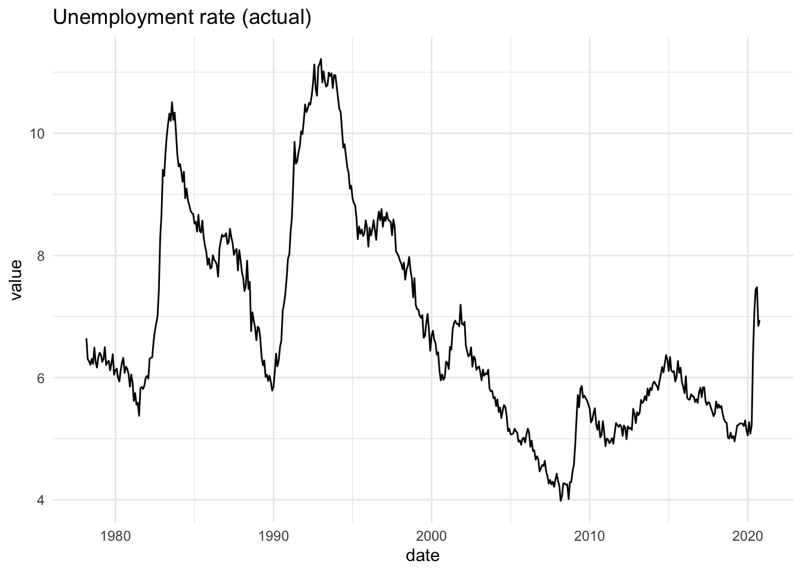
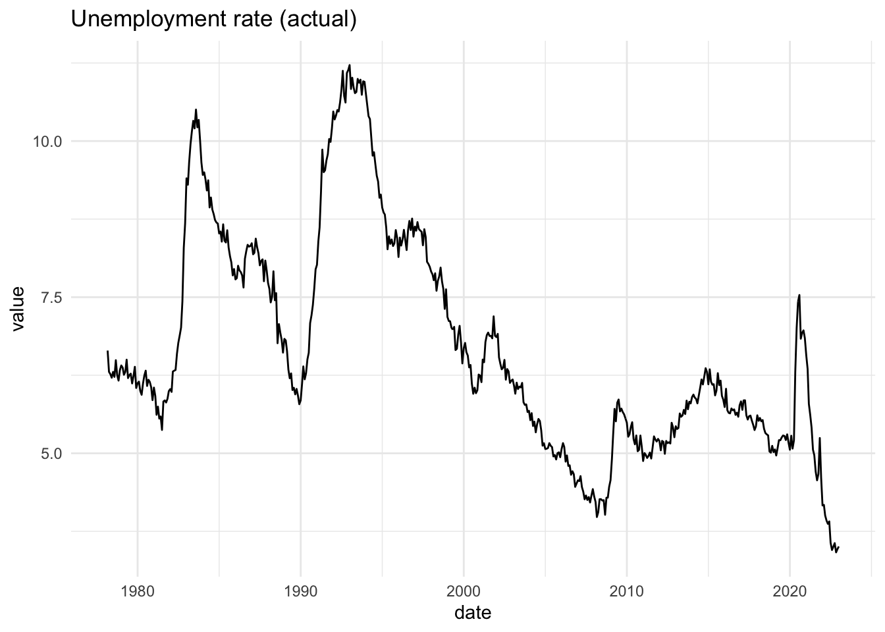

<!-- README.md is generated from README.Rmd. Please edit that file -->

# readrba 

<!-- badges: start -->

[](https://github.com/MattCowgill/readrba/actions)
[](https://www.tidyverse.org/lifecycle/#maturing)
[](https://codecov.io/gh/MattCowgill/readrba?branch=master)
<!-- badges: end -->

Get data from the [Reserve Bank of
Australia](https://rba.gov.au/statistics/tables/) in a
[tidy](https://tidyr.tidyverse.org/articles/tidy-data.html)
[tibble](https://tibble.tidyverse.org).

## Installation

The package is not yet on CRAN. Install from GitHub:

``` r
remotes::install_github("mattcowgill/readrba")
```

## Examples

``` r
library(ggplot2)
library(dplyr)
#> 
#> Attaching package: 'dplyr'
#> The following objects are masked from 'package:stats':
#> 
#>     filter, lag
#> The following objects are masked from 'package:base':
#> 
#>     intersect, setdiff, setequal, union
library(readrba)
```

### Quick examples

With a few lines of code, you can get a data series from the RBA and
visualise it. Here’s the unemployment rate:

``` r
unemp_rate <- read_rba(series_id = "GLFSURSA") 
#> Downloading https://rba.gov.au/statistics/tables/xls/h05hist.xls

unemp_rate %>%
  ggplot(aes(x = date, y = value)) +
  geom_line() +
  theme_minimal() +
  labs(title = "Unemployment rate (actual)")
```



And you can also easily get the RBA’s public forecasts - from 1990 to
present - and visualise those. Here’s every public forecast of the
unemployment rate the RBA has made over the past three decades:

``` r
unemp_forecasts <- rba_forecasts() %>%
  filter(series == "unemp_rate")

unemp_forecasts %>%
  ggplot(aes(x = date, y = value, group = forecast_date)) +
  geom_line() +
  theme_minimal() +
  labs(title = "Unemployment rate (RBA forecasts)")
```



### Reading RBA data

There primary function in {readrba} is `read_rba()`.

Here’s how you fetch the current version of a single RBA statistical
table: table G1, consumer price inflation using `read_rba()`:

``` r
cpi_table <- read_rba(table_no = "g1")
#> Downloading https://rba.gov.au/statistics/tables/xls/g01hist.xls
```

The object returned by `read_rba()` is a tidy tibble (ie. in ‘long’
format):

``` r
head(cpi_table)
#> # A tibble: 6 x 11
#>   date       series value frequency series_type units source pub_date  
#>   <date>     <chr>  <dbl> <chr>     <chr>       <chr> <chr>  <date>    
#> 1 1922-06-01 Consu…   2.8 Quarterly Original    Inde… ABS /… 2020-10-29
#> 2 1922-09-01 Consu…   2.8 Quarterly Original    Inde… ABS /… 2020-10-29
#> 3 1922-12-01 Consu…   2.7 Quarterly Original    Inde… ABS /… 2020-10-29
#> 4 1923-03-01 Consu…   2.7 Quarterly Original    Inde… ABS /… 2020-10-29
#> 5 1923-06-01 Consu…   2.8 Quarterly Original    Inde… ABS /… 2020-10-29
#> 6 1923-09-01 Consu…   2.9 Quarterly Original    Inde… ABS /… 2020-10-29
#> # … with 3 more variables: series_id <chr>, description <chr>,
#> #   table_title <chr>
```

You can also request multiple tables. They’ll be returned together as
one tidy tibble:

``` r
rba_data <- read_rba(table_no = c("a1", "g1"))
#> Downloading https://rba.gov.au/statistics/tables/xls/a01whist-summary.xls
#> https://rba.gov.au/statistics/tables/xls/g01hist.xls

head(rba_data)
#> # A tibble: 6 x 11
#>   date       series value frequency series_type units source pub_date  
#>   <date>     <chr>  <dbl> <chr>     <chr>       <chr> <chr>  <date>    
#> 1 1994-06-01 Austr… 13680 Weekly    Original    $ mi… RBA    2020-12-04
#> 2 1994-06-08 Austr… 13055 Weekly    Original    $ mi… RBA    2020-12-04
#> 3 1994-06-15 Austr… 13086 Weekly    Original    $ mi… RBA    2020-12-04
#> 4 1994-06-22 Austr… 12802 Weekly    Original    $ mi… RBA    2020-12-04
#> 5 1994-06-29 Austr… 13563 Weekly    Original    $ mi… RBA    2020-12-04
#> 6 1994-07-06 Austr… 12179 Weekly    Original    $ mi… RBA    2020-12-04
#> # … with 3 more variables: series_id <chr>, description <chr>,
#> #   table_title <chr>

unique(rba_data$table_title)
#> [1] "A1 Reserve Bank Of Australia - Liabilities And Assets - Summary"
#> [2] "G1 Consumer Price Inflation"
```

You can also retrieve data based on the unique RBA time series
identifier(s). For example, to getch the consumer price index series
only:

``` r
cpi_series <- read_rba(series_id = "GCPIAG")
#> Downloading https://rba.gov.au/statistics/tables/xls/g01hist.xls
head(cpi_series)
#> # A tibble: 6 x 11
#>   date       series value frequency series_type units source pub_date  
#>   <date>     <chr>  <dbl> <chr>     <chr>       <chr> <chr>  <date>    
#> 1 1922-06-01 Consu…   2.8 Quarterly Original    Inde… ABS /… 2020-10-29
#> 2 1922-09-01 Consu…   2.8 Quarterly Original    Inde… ABS /… 2020-10-29
#> 3 1922-12-01 Consu…   2.7 Quarterly Original    Inde… ABS /… 2020-10-29
#> 4 1923-03-01 Consu…   2.7 Quarterly Original    Inde… ABS /… 2020-10-29
#> 5 1923-06-01 Consu…   2.8 Quarterly Original    Inde… ABS /… 2020-10-29
#> 6 1923-09-01 Consu…   2.9 Quarterly Original    Inde… ABS /… 2020-10-29
#> # … with 3 more variables: series_id <chr>, description <chr>,
#> #   table_title <chr>
unique(cpi_series$series_id)
#> [1] "GCPIAG"
```

The convenience function `read_rba_seriesid()` is a wrapper around
`read_rba()`. This means `read_rba_seriesid("GCPIAG")` is equivalent to
`read_rba(series_id = "GCPIAG")`.

By default, `read_rba()` fetches the current version of whatever table
you request. You can specify the historical version of a table, if it’s
available, using the `cur_hist` argument:

``` r
hist_a11 <- read_rba(table_no = "a1.1", cur_hist = "historical")
#> Downloading https://rba.gov.au/statistics/tables/xls-hist/a01hist.xls

head(hist_a11)
#> # A tibble: 6 x 11
#>   date       series value frequency series_type units source pub_date  
#>   <date>     <chr>  <dbl> <chr>     <chr>       <chr> <chr>  <date>    
#> 1 1977-07-31 Austr…   654 Monthly   Original; … $ mi… RBA    2015-06-26
#> 2 1977-08-31 Austr…   665 Monthly   Original; … $ mi… RBA    2015-06-26
#> 3 1977-09-30 Austr…   695 Monthly   Original; … $ mi… RBA    2015-06-26
#> 4 1977-10-31 Austr…   609 Monthly   Original; … $ mi… RBA    2015-06-26
#> 5 1977-11-30 Austr…   560 Monthly   Original; … $ mi… RBA    2015-06-26
#> 6 1977-12-31 Austr…   614 Monthly   Original; … $ mi… RBA    2015-06-26
#> # … with 3 more variables: series_id <chr>, description <chr>,
#> #   table_title <chr>
```

### Browsing RBA data

Two functions are provided to help you find the table number or series
ID you need. These are `browse_rba_tables()` and `browse_rba_series()`.
Each returns a tibble with information about the available RBA data.

``` r
browse_rba_tables()
#> # A tibble: 123 x 5
#>    title                   no    url                  current_or_histo… readable
#>    <chr>                   <chr> <chr>                <chr>             <lgl>   
#>  1 Liabilities and Assets… A1    https://rba.gov.au/… current           TRUE    
#>  2 Liabilities and Assets… A1.1  https://rba.gov.au/… current           TRUE    
#>  3 Monetary Policy Changes A2    https://rba.gov.au/… current           TRUE    
#>  4 Monetary Policy Operat… A3    https://rba.gov.au/… current           TRUE    
#>  5 Holdings of Australian… A3.1  https://rba.gov.au/… current           TRUE    
#>  6 Foreign Exchange Trans… A4    https://rba.gov.au/… current           TRUE    
#>  7 Daily Foreign Exchange… A5    https://rba.gov.au/… current           TRUE    
#>  8 Banknotes on Issue by … A6    https://rba.gov.au/… current           TRUE    
#>  9 Detected Australian Co… A7    https://rba.gov.au/… current           TRUE    
#> 10 Assets of Financial In… B1    https://rba.gov.au/… current           TRUE    
#> # … with 113 more rows
```

``` r
browse_rba_series()
#> # A tibble: 4,259 x 8
#>    table_no series series_id series_type table_title cur_hist description
#>    <chr>    <chr>  <chr>     <chr>       <chr>       <chr>    <chr>      
#>  1 A1       Austr… ARBAAASTW Original    A1 Reserve… current  Australian…
#>  2 A1       Capit… ARBALCRFW Original    A1 Reserve… current  Capital an…
#>  3 A1       Depos… ARBALDEPW Original    A1 Reserve… current  Deposits (…
#>  4 A1       Excha… ARBALESBW Original    A1 Reserve… current  Exchange s…
#>  5 A1       Gold … ARBAAGFXW Original    A1 Reserve… current  Gold and f…
#>  6 A1       Notes… ARBALNOIW Original    A1 Reserve… current  Notes on i…
#>  7 A1       Other… ARBAAOAW  Original    A1 Reserve… current  Other asse…
#>  8 A1       Other… ARBALOLW  Original    A1 Reserve… current  Other liab…
#>  9 A1       Total… ARBAATAW  Original    A1 Reserve… current  Total RBA …
#> 10 A1       Total… ARBALTLW  Original    A1 Reserve… current  Total RBA …
#> # … with 4,249 more rows, and 1 more variable: frequency <chr>
```

You can specify a search string to filter the tables or series, as in:

``` r
browse_rba_tables("inflation")
#> # A tibble: 3 x 5
#>   title                 no    url                     current_or_histo… readable
#>   <chr>                 <chr> <chr>                   <chr>             <lgl>   
#> 1 Consumer Price Infla… G1    https://rba.gov.au/sta… current           TRUE    
#> 2 Consumer Price Infla… G2    https://rba.gov.au/sta… current           TRUE    
#> 3 Inflation Expectatio… G3    https://rba.gov.au/sta… current           TRUE
```

### RBA forecasts

The function `rba_forecasts()` provides easy access to all the RBA’s
public forecasts of key economic variables since 1990. The function
scrapes the RBA website to obtain the latest Statement on Monetary
Policy forecasts.

``` r
rba_forecasts()
#> # A tibble: 6,355 x 8
#>    series_desc    forecast_date notes source value date       year_qtr series   
#>    <chr>          <date>        <chr> <chr>  <dbl> <date>        <dbl> <chr>    
#>  1 CPI - 4 quart… 1990-03-01    <NA>  JEFG     8.6 1990-03-01    1990. cpi_annu…
#>  2 CPI - 4 quart… 1990-03-01    <NA>  JEFG     7.6 1990-06-01    1990. cpi_annu…
#>  3 CPI - 4 quart… 1990-03-01    <NA>  JEFG     6.5 1990-09-01    1990. cpi_annu…
#>  4 CPI - 4 quart… 1990-03-01    <NA>  JEFG     6   1990-12-01    1990. cpi_annu…
#>  5 CPI - 4 quart… 1990-03-01    <NA>  JEFG     5.9 1991-03-01    1991. cpi_annu…
#>  6 CPI - 4 quart… 1990-03-01    <NA>  JEFG     6.2 1991-06-01    1991. cpi_annu…
#>  7 Unemployment … 1990-03-01    <NA>  JEFG     5.9 1989-12-01    1989. unemp_ra…
#>  8 Unemployment … 1990-03-01    <NA>  JEFG     6.3 1990-03-01    1990. unemp_ra…
#>  9 Unemployment … 1990-03-01    <NA>  JEFG     6.5 1990-06-01    1990. unemp_ra…
#> 10 Unemployment … 1990-03-01    <NA>  JEFG     6.7 1990-09-01    1990. unemp_ra…
#> # … with 6,345 more rows
```

If you just want the latest forecasts, you can request them:

``` r
rba_forecasts(all_or_latest = "latest")
#> # A tibble: 102 x 8
#>    forecast_date date       series   value series_desc  source notes    year_qtr
#>    <date>        <date>     <chr>    <dbl> <chr>        <chr>  <chr>       <dbl>
#>  1 2020-11-01    2020-06-01 aena_c…  11.6  Nominal (no… SMP    (a) For…    2020.
#>  2 2020-11-01    2020-12-01 aena_c…   4.25 Nominal (no… SMP    (a) For…    2020.
#>  3 2020-11-01    2021-06-01 aena_c…  -7.25 Nominal (no… SMP    (a) For…    2021.
#>  4 2020-11-01    2021-12-01 aena_c…  -2.25 Nominal (no… SMP    (a) For…    2021.
#>  5 2020-11-01    2022-06-01 aena_c…   1    Nominal (no… SMP    (a) For…    2022.
#>  6 2020-11-01    2022-12-01 aena_c…   1.75 Nominal (no… SMP    (a) For…    2022.
#>  7 2020-11-01    2020-06-01 busine…  -5.5  Business in… SMP    (a) For…    2020.
#>  8 2020-11-01    2020-12-01 busine… -14    Business in… SMP    (a) For…    2020.
#>  9 2020-11-01    2021-06-01 busine…  -9    Business in… SMP    (a) For…    2021.
#> 10 2020-11-01    2021-12-01 busine…   4    Business in… SMP    (a) For…    2021.
#> # … with 92 more rows
```

## Data availability

The `read_rba()` function is able to import most tables on the
[Statistical Tables](https://rba.gov.au/statistics/tables/) page of the
RBA website. These are the tables that are downloaded when you use
`read_rba(cur_hist = "current")`, the default.

`read_rba()` can also download many of the tables on the [Historical
Data](https://rba.gov.au/statistics/historical-data.html) page of the
RBA website. To get these, specify `cur_hist = "historical"` in
`read_rba()`.

### Historical exchange rate tables

The historical exchange rate tables do not have table numbers on the RBA
website. They can still be downloaded, using the following table
numbers:

| Table title                                                                      | table\_no          |
|:---------------------------------------------------------------------------------|:-------------------|
| Exchange Rates – Daily – 1983 to 1986                                            | ex\_daily\_8386    |
| Exchange Rates – Daily – 1987 to 1990                                            | ex\_daily\_8790    |
| Exchange Rates – Daily – 1991 to 1994                                            | ex\_daily\_9194    |
| Exchange Rates – Daily – 1995 to 1998                                            | ex\_daily\_9598    |
| Exchange Rates – Daily – 1999 to 2002                                            | ex\_daily\_9902    |
| Exchange Rates – Daily – 2003 to 2006                                            | ex\_daily\_0306    |
| Exchange Rates – Daily – 2007 to 2009                                            | ex\_daily\_0709    |
| Exchange Rates – Daily – 2010 to 2013                                            | ex\_daily\_1013    |
| Exchange Rates – Daily – 2014 to 2017                                            | ex\_daily\_1417    |
| Exchange Rates – Daily – 2018 to Current                                         | ex\_daily\_18cur   |
| Exchange Rates – Monthly – January 2010 to latest complete month of current year | ex\_monthly\_10cur |
| Exchange Rates – Monthly – July 1969 to December 2009                            | ex\_monthly\_6909  |

### Non-standard tables

`read_rba()` is currently only able to import RBA statistical tables
that are formatted in a (more or less) standard way. Some are formatted
in a non-standard way, either because they’re distributions rather than
time series, or because they’re particularly old.

Tables that are **not** able to be downloaded are:

| Table title                                                               | table\_no | current\_or\_historical |
|:--------------------------------------------------------------------------|:----------|:------------------------|
| Household Balance Sheets – Distribution                                   | E3        | current                 |
| Household Gearing – Distribution                                          | E4        | current                 |
| Household Financial Assets – Distribution                                 | E5        | current                 |
| Household Non-Financial Assets – Distribution                             | E6        | current                 |
| Household Debt – Distribution                                             | E7        | current                 |
| Open Market Operations – 2012 to 2013                                     | A3        | historical              |
| Open Market Operations – 2009 to 2011                                     | A3        | historical              |
| Open Market Operations – 2003 to 2008                                     | A3        | historical              |
| Individual Banks’ Assets – 1991–1992 to 1997–1998                         | J1        | historical              |
| Individual Banks’ Liabilities – 1991–1992 to 1997–1998                    | J2        | historical              |
| Treasury Note Tenders - 1989–2006                                         | E4        | historical              |
| Treasury Bond Tenders – 1982–2006                                         | E5        | historical              |
| Treasury Bond Tenders – Amount Allotted, by Years to Maturity – 1982–2006 | E5        | historical              |
| Treasury Bond Switch Tenders – 2008                                       | E6        | historical              |
| Treasury Capital Indexed Bonds – 1985–2006                                | E7        | historical              |
| Zero-coupon Interest Rates – Analytical Series – 1992 to 2008             | F17       | historical              |

## Issues and contributions

I welcome any feature requests or bug reports. The best way is to file a
[GitHub issue](https://github.com/MattCowgill/readrba/issues).

I would welcome contributions to the package. Please start by filing an
issue, outlining the bug you intend to fix or functionality you intend
to add or modify.

## Disclaimer

This package is not affiliated with or endorsed by the Reserve Bank of
Australia. All data is provided subject to any conditions and
restrictions set out on the RBA website.
