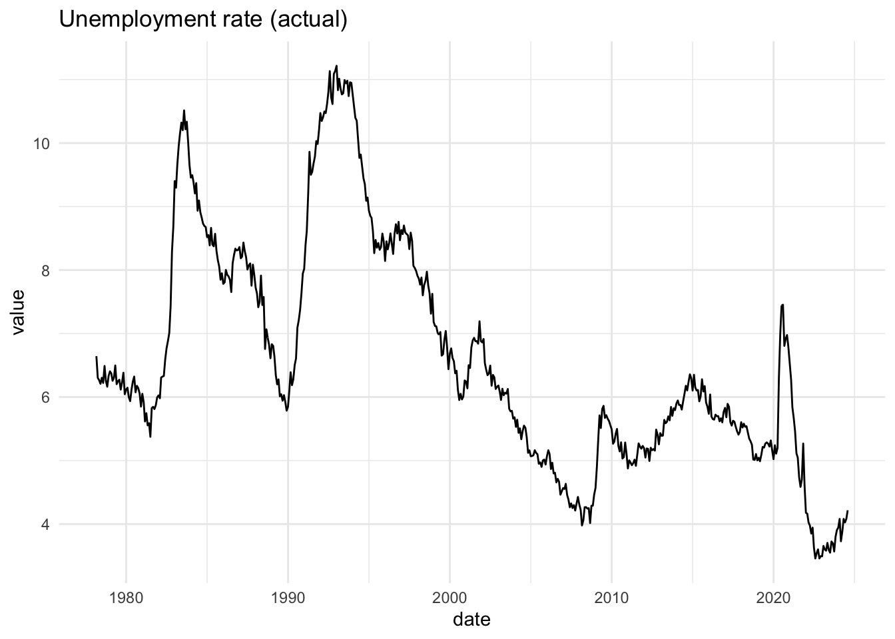

<!-- README.md is generated from README.Rmd. Please edit that file -->

# readrba 

<!-- badges: start -->

[](https://github.com/MattCowgill/readrba/actions)
[](https://lifecycle.r-lib.org/articles/stages.html)
[](https://codecov.io/gh/MattCowgill/readrba?branch=master)
[](https://CRAN.R-project.org/package=readrba)
<!-- badges: end -->

Get data from the [Reserve Bank of
Australia](https://rba.gov.au/statistics/tables/) in a
[tidy](https://tidyr.tidyverse.org/articles/tidy-data.html)
[tibble](https://tibble.tidyverse.org).

## Installation

Install from CRAN using:

``` r
install.packages("readrba")
```

Or install the development version from GitHub:

``` r
remotes::install_github("mattcowgill/readrba")
```

## Examples

``` r
library(ggplot2)
library(dplyr)
library(readrba)
```

### Quick examples

With a few lines of code, you can get a data series from the RBA and
visualise it. Here’s the unemployment rate:

``` r
unemp_rate <- read_rba(series_id = "GLFSURSA") 

unemp_rate %>%
  ggplot(aes(x = date, y = value)) +
  geom_line() +
  theme_minimal() +
  labs(title = "Unemployment rate (actual)")
```



And you can also easily get the RBA’s public forecasts - from 1990 to
present - and visualise those. Here’s every public forecast of the
unemployment rate the RBA has made over the past three decades:

``` r
unemp_forecasts <- rba_forecasts() %>%
  filter(series == "unemp_rate")


unemp_forecasts %>%
  ggplot(aes(x = date, 
             y = value, 
             group = forecast_date, 
             col = forecast_date)) +
  geom_line() +
  theme_minimal() +
  labs(title = "Unemployment rate (RBA forecasts)")
```


### Reading RBA data

There primary function in {readrba} is `read_rba()`.

Here’s how you fetch the current version of a single RBA statistical
table: table G1, consumer price inflation using `read_rba()`:

``` r
cpi_table <- read_rba(table_no = "g1")
```

The object returned by `read_rba()` is a tidy tibble (ie. in ‘long’
format):

``` r
head(cpi_table)
#> # A tibble: 6 × 11
#>   date       series               value frequency series_type units source pub_date  
#>   <date>     <chr>                <dbl> <chr>     <chr>       <chr> <chr>  <date>    
#> 1 1922-06-01 Consumer price index   2.8 Quarterly Original    Inde… ABS /… 2021-07-29
#> 2 1922-09-01 Consumer price index   2.8 Quarterly Original    Inde… ABS /… 2021-07-29
#> 3 1922-12-01 Consumer price index   2.7 Quarterly Original    Inde… ABS /… 2021-07-29
#> 4 1923-03-01 Consumer price index   2.7 Quarterly Original    Inde… ABS /… 2021-07-29
#> 5 1923-06-01 Consumer price index   2.8 Quarterly Original    Inde… ABS /… 2021-07-29
#> 6 1923-09-01 Consumer price index   2.9 Quarterly Original    Inde… ABS /… 2021-07-29
#> # … with 3 more variables: series_id <chr>, description <chr>,
#> #   table_title <chr>
```

You can also request multiple tables. They’ll be returned together as
one tidy tibble:

``` r
rba_data <- read_rba(table_no = c("a1", "g1"))

head(rba_data)
#> # A tibble: 6 × 11
#>   date       series         value frequency series_type units  source pub_date  
#>   <date>     <chr>          <dbl> <chr>     <chr>       <chr>  <chr>  <date>    
#> 1 1994-06-01 Australian do… 13680 Weekly    Original    $ mil… RBA    2021-09-03
#> 2 1994-06-08 Australian do… 13055 Weekly    Original    $ mil… RBA    2021-09-03
#> 3 1994-06-15 Australian do… 13086 Weekly    Original    $ mil… RBA    2021-09-03
#> 4 1994-06-22 Australian do… 12802 Weekly    Original    $ mil… RBA    2021-09-03
#> 5 1994-06-29 Australian do… 13563 Weekly    Original    $ mil… RBA    2021-09-03
#> 6 1994-07-06 Australian do… 12179 Weekly    Original    $ mil… RBA    2021-09-03
#> # … with 3 more variables: series_id <chr>, description <chr>,
#> #   table_title <chr>

unique(rba_data$table_title)
#> [1] "A1 Reserve Bank Of Australia - Liabilities And Assets - Summary"
#> [2] "G1 Consumer Price Inflation"
```

You can also retrieve data based on the unique RBA time series
identifier(s). For example, to getch the consumer price index series
only:

``` r
cpi_series <- read_rba(series_id = "GCPIAG")
head(cpi_series)
#> # A tibble: 6 × 11
#>   date       series               value frequency series_type units source pub_date  
#>   <date>     <chr>                <dbl> <chr>     <chr>       <chr> <chr>  <date>    
#> 1 1922-06-01 Consumer price index   2.8 Quarterly Original    Inde… ABS /… 2021-07-29
#> 2 1922-09-01 Consumer price index   2.8 Quarterly Original    Inde… ABS /… 2021-07-29
#> 3 1922-12-01 Consumer price index   2.7 Quarterly Original    Inde… ABS /… 2021-07-29
#> 4 1923-03-01 Consumer price index   2.7 Quarterly Original    Inde… ABS /… 2021-07-29
#> 5 1923-06-01 Consumer price index   2.8 Quarterly Original    Inde… ABS /… 2021-07-29
#> 6 1923-09-01 Consumer price index   2.9 Quarterly Original    Inde… ABS /… 2021-07-29
#> # … with 3 more variables: series_id <chr>, description <chr>,
#> #   table_title <chr>
unique(cpi_series$series_id)
#> [1] "GCPIAG"
```

The convenience function `read_rba_seriesid()` is a wrapper around
`read_rba()`. This means `read_rba_seriesid("GCPIAG")` is equivalent to
`read_rba(series_id = "GCPIAG")`.

By default, `read_rba()` fetches the current version of whatever table
you request. You can specify the historical version of a table, if it’s
available, using the `cur_hist` argument:

``` r
hist_a11 <- read_rba(table_no = "a1.1", cur_hist = "historical")

head(hist_a11)
#> # A tibble: 6 × 11
#>   date       series     value frequency series_type      units source pub_date  
#>   <date>     <chr>      <dbl> <chr>     <chr>            <chr> <chr>  <date>    
#> 1 1977-07-31 Australia…   654 Monthly   Original; avera… $ mi… RBA    2015-06-26
#> 2 1977-08-31 Australia…   665 Monthly   Original; avera… $ mi… RBA    2015-06-26
#> 3 1977-09-30 Australia…   695 Monthly   Original; avera… $ mi… RBA    2015-06-26
#> 4 1977-10-31 Australia…   609 Monthly   Original; avera… $ mi… RBA    2015-06-26
#> 5 1977-11-30 Australia…   560 Monthly   Original; avera… $ mi… RBA    2015-06-26
#> 6 1977-12-31 Australia…   614 Monthly   Original; avera… $ mi… RBA    2015-06-26
#> # … with 3 more variables: series_id <chr>, description <chr>,
#> #   table_title <chr>
```

### Browsing RBA data

Two functions are provided to help you find the table number or series
ID you need. These are `browse_rba_tables()` and `browse_rba_series()`.
Each returns a tibble with information about the available RBA data.

``` r
browse_rba_tables()
#> # A tibble: 122 × 5
#>    title                  no    url                   current_or_histo… readable
#>    <chr>                  <chr> <chr>                 <chr>             <lgl>   
#>  1 Liabilities and Asset… A1    https://www.rba.gov.… current           TRUE    
#>  2 Liabilities and Asset… A1.1  https://www.rba.gov.… current           TRUE    
#>  3 Monetary Policy Chang… A2    https://www.rba.gov.… current           TRUE    
#>  4 Monetary Policy Opera… A3    https://www.rba.gov.… current           TRUE    
#>  5 Holdings of Australia… A3.1  https://www.rba.gov.… current           TRUE    
#>  6 Foreign Exchange Tran… A4    https://www.rba.gov.… current           TRUE    
#>  7 Daily Foreign Exchang… A5    https://www.rba.gov.… current           TRUE    
#>  8 Banknotes on Issue by… A6    https://www.rba.gov.… current           TRUE    
#>  9 Detected Australian C… A7    https://www.rba.gov.… current           TRUE    
#> 10 Assets of Financial I… B1    https://www.rba.gov.… current           TRUE    
#> # … with 112 more rows
```

``` r
browse_rba_series()
#> # A tibble: 4,394 × 8
#>    table_no series   series_id series_type table_title    cur_hist description  
#>    <chr>    <chr>    <chr>     <chr>       <chr>          <chr>    <chr>        
#>  1 A1       Austral… ARBAAASTW Original    A1 Reserve Ba… current  Australian d…
#>  2 A1       Capital… ARBALCRFW Original    A1 Reserve Ba… current  Capital and …
#>  3 A1       Deposit… ARBALDEPW Original    A1 Reserve Ba… current  Deposits (ex…
#>  4 A1       Exchang… ARBALESBW Original    A1 Reserve Ba… current  Exchange set…
#>  5 A1       Gold an… ARBAAGFXW Original    A1 Reserve Ba… current  Gold and for…
#>  6 A1       Notes o… ARBALNOIW Original    A1 Reserve Ba… current  Notes on iss…
#>  7 A1       Other a… ARBAAOAW  Original    A1 Reserve Ba… current  Other assets…
#>  8 A1       Other l… ARBALOLW  Original    A1 Reserve Ba… current  Other liabil…
#>  9 A1       Total a… ARBAATAW  Original    A1 Reserve Ba… current  Total RBA as…
#> 10 A1       Total l… ARBALTLW  Original    A1 Reserve Ba… current  Total RBA li…
#> # … with 4,384 more rows, and 1 more variable: frequency <chr>
```

You can specify a search string to filter the tables or series, as in:

``` r
browse_rba_tables("inflation")
#> # A tibble: 3 × 5
#>   title                no    url                      current_or_histo… readable
#>   <chr>                <chr> <chr>                    <chr>             <lgl>   
#> 1 Consumer Price Infl… G1    https://www.rba.gov.au/… current           TRUE    
#> 2 Consumer Price Infl… G2    https://www.rba.gov.au/… current           TRUE    
#> 3 Inflation Expectati… G3    https://www.rba.gov.au/… current           TRUE
```

### RBA forecasts

The function `rba_forecasts()` provides easy access to all the RBA’s
public forecasts of key economic variables since 1990. The function
scrapes the RBA website to obtain the latest Statement on Monetary
Policy forecasts.

``` r
rba_forecasts()
#> # A tibble: 6,541 × 8
#>    series_desc    forecast_date notes source value date       year_qtr series   
#>    <chr>          <date>        <chr> <chr>  <dbl> <date>        <dbl> <chr>    
#>  1 CPI - 4 quart… 1990-03-01    <NA>  JEFG     8.6 1990-03-01    1990. cpi_annu…
#>  2 CPI - 4 quart… 1990-03-01    <NA>  JEFG     7.6 1990-06-01    1990. cpi_annu…
#>  3 CPI - 4 quart… 1990-03-01    <NA>  JEFG     6.5 1990-09-01    1990. cpi_annu…
#>  4 CPI - 4 quart… 1990-03-01    <NA>  JEFG     6   1990-12-01    1990. cpi_annu…
#>  5 CPI - 4 quart… 1990-03-01    <NA>  JEFG     5.9 1991-03-01    1991. cpi_annu…
#>  6 CPI - 4 quart… 1990-03-01    <NA>  JEFG     6.2 1991-06-01    1991. cpi_annu…
#>  7 Unemployment … 1990-03-01    <NA>  JEFG     5.9 1989-12-01    1989. unemp_ra…
#>  8 Unemployment … 1990-03-01    <NA>  JEFG     6.3 1990-03-01    1990. unemp_ra…
#>  9 Unemployment … 1990-03-01    <NA>  JEFG     6.5 1990-06-01    1990. unemp_ra…
#> 10 Unemployment … 1990-03-01    <NA>  JEFG     6.7 1990-09-01    1990. unemp_ra…
#> # … with 6,531 more rows
```

If you just want the latest forecasts, you can request them:

``` r
rba_forecasts(all_or_latest = "latest")
#> # A tibble: 102 × 8
#>    forecast_date date       series  value series_desc   source notes    year_qtr
#>    <date>        <date>     <chr>   <dbl> <chr>         <chr>  <chr>       <dbl>
#>  1 2021-08-01    2021-06-01 aena_c… -5.25 Nominal (non… SMP    (a) For…    2021.
#>  2 2021-08-01    2021-12-01 aena_c… -0.75 Nominal (non… SMP    (a) For…    2021.
#>  3 2021-08-01    2022-06-01 aena_c…  2.25 Nominal (non… SMP    (a) For…    2022.
#>  4 2021-08-01    2022-12-01 aena_c…  2.75 Nominal (non… SMP    (a) For…    2022.
#>  5 2021-08-01    2023-06-01 aena_c…  3    Nominal (non… SMP    (a) For…    2023.
#>  6 2021-08-01    2023-12-01 aena_c…  3    Nominal (non… SMP    (a) For…    2023.
#>  7 2021-08-01    2021-06-01 busine…  4.75 Business inv… SMP    (a) For…    2021.
#>  8 2021-08-01    2021-12-01 busine…  8.5  Business inv… SMP    (a) For…    2021.
#>  9 2021-08-01    2022-06-01 busine…  8    Business inv… SMP    (a) For…    2022.
#> 10 2021-08-01    2022-12-01 busine…  9    Business inv… SMP    (a) For…    2022.
#> # … with 92 more rows
```

## Data availability

The `read_rba()` function is able to import most tables on the
[Statistical Tables](https://rba.gov.au/statistics/tables/) page of the
RBA website. These are the tables that are downloaded when you use
`read_rba(cur_hist = "current")`, the default.

`read_rba()` can also download many of the tables on the [Historical
Data](https://rba.gov.au/statistics/historical-data.html) page of the
RBA website. To get these, specify `cur_hist = "historical"` in
`read_rba()`.

### Historical exchange rate tables

The historical exchange rate tables do not have table numbers on the RBA
website. They can still be downloaded, using the following table
numbers:

| Table title                                                                      | table\_no          |
|:---------------------------------------------------------------------------------|:-------------------|
| Exchange Rates – Daily – 1983 to 1986                                            | ex\_daily\_8386    |
| Exchange Rates – Daily – 1987 to 1990                                            | ex\_daily\_8790    |
| Exchange Rates – Daily – 1991 to 1994                                            | ex\_daily\_9194    |
| Exchange Rates – Daily – 1995 to 1998                                            | ex\_daily\_9598    |
| Exchange Rates – Daily – 1999 to 2002                                            | ex\_daily\_9902    |
| Exchange Rates – Daily – 2003 to 2006                                            | ex\_daily\_0306    |
| Exchange Rates – Daily – 2007 to 2009                                            | ex\_daily\_0709    |
| Exchange Rates – Daily – 2010 to 2013                                            | ex\_daily\_1013    |
| Exchange Rates – Daily – 2014 to 2017                                            | ex\_daily\_1417    |
| Exchange Rates – Daily – 2018 to Current                                         | ex\_daily\_18cur   |
| Exchange Rates – Monthly – January 2010 to latest complete month of current year | ex\_monthly\_10cur |
| Exchange Rates – Monthly – July 1969 to December 2009                            | ex\_monthly\_6909  |

### Non-standard tables

`read_rba()` is currently only able to import RBA statistical tables
that are formatted in a (more or less) standard way. Some are formatted
in a non-standard way, either because they’re distributions rather than
time series, or because they’re particularly old.

Tables that are **not** able to be downloaded are:

| Table title                                                               | table\_no | current\_or\_historical |
|:--------------------------------------------------------------------------|:----------|:------------------------|
| Household Balance Sheets – Distribution                                   | E3        | current                 |
| Household Gearing – Distribution                                          | E4        | current                 |
| Household Financial Assets – Distribution                                 | E5        | current                 |
| Household Non-Financial Assets – Distribution                             | E6        | current                 |
| Household Debt – Distribution                                             | E7        | current                 |
| Open Market Operations – 2012 to 2013                                     | A3        | historical              |
| Open Market Operations – 2009 to 2011                                     | A3        | historical              |
| Open Market Operations – 2003 to 2008                                     | A3        | historical              |
| Individual Banks’ Assets – 1991–1992 to 1997–1998                         | J1        | historical              |
| Individual Banks’ Liabilities – 1991–1992 to 1997–1998                    | J2        | historical              |
| Treasury Note Tenders - 1989–2006                                         | E4        | historical              |
| Treasury Bond Tenders – 1982–2006                                         | E5        | historical              |
| Treasury Bond Tenders – Amount Allotted, by Years to Maturity – 1982–2006 | E5        | historical              |
| Treasury Bond Switch Tenders – 2008                                       | E6        | historical              |
| Treasury Capital Indexed Bonds – 1985–2006                                | E7        | historical              |

## Issues and contributions

I welcome any feature requests or bug reports. The best way is to file a
[GitHub issue](https://github.com/MattCowgill/readrba/issues).

I would welcome contributions to the package. Please start by filing an
issue, outlining the bug you intend to fix or functionality you intend
to add or modify.

## Disclaimer

This package is not affiliated with or endorsed by the Reserve Bank of
Australia. All data is provided subject to any conditions and
restrictions set out on the RBA website.
